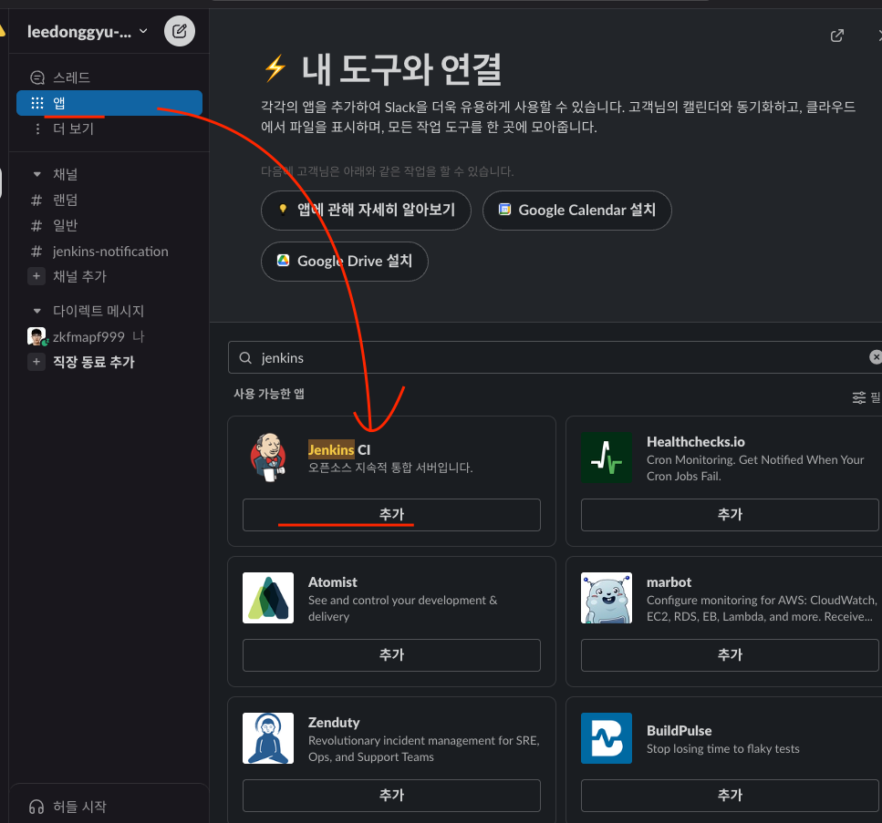
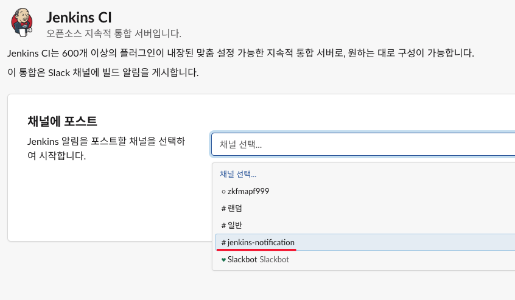
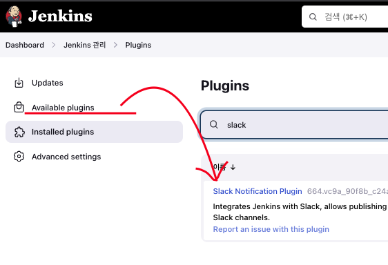
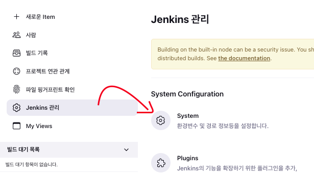
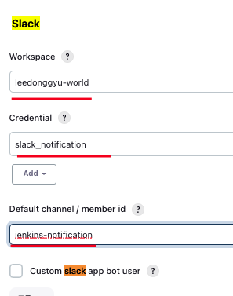
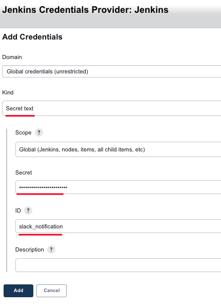
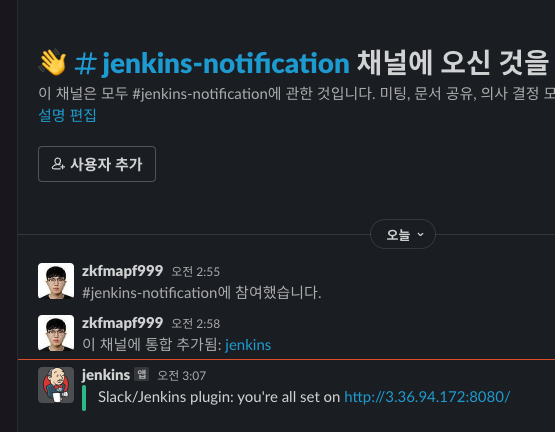

# CICD-pipeline


## Jenkins install

```
    host에 Docker에 접근하는 방식 (DooD)을 사용하기 때문에,
    host에 user, group을 먼저 설정해줘야 함

    useradd ...
    groupadd ...
```

- install docker (util_file/docker.sh)
- build docker images (util_file/Dockerfil.jenkins)

```
    docker build -f Dockerfile.jenkins -t jenkins:1.0
```

- run jenkins container

```
    docker run -d --name jenkins_container \
    -v /var/run/docker.sock:/var/run/docker.sock \
    -v jenkins_volume:/var/jenkins_home \
    --restart=always \
    -p 8080:8080 jenkins:1.0

    chmod 777 /var/run/docker.sock
```

## Slack 추가하는 법

### 1. Slack에서 App 추가 (Admin이 해줘야 함)



### 2. Slack Channel 추가 (Admin이 해줘야 함)



### 3. Jenkins Plugin 추가 (Slack Notification)



### 4. Jenkins Management -> System Setting



### 5. Slack 추가 & Credential 설정





### 6. Test Connection



## Reference

- t2.micro로 하니까 Docker가 못버텨주네... -> t3.small 정도는 해야함 (시간 애뺐김)
- <a href="https://plugins.jenkins.io/amazon-ecr/">Jenkins AmazonECR Registry 입력하는 법</a>
- <a href="https://tech.cloud.nongshim.co.kr/2021/08/30/hands-on-ci-cd-jenkins-pipeline%EC%9D%84-%EC%9D%B4%EC%9A%A9%ED%95%9C-ecs-%EB%B0%B0%ED%8F%AC/">Jenkins Credentials withAWS 설정</a>
- <a href="https://teichae.tistory.com/entry/Jenkins-Pipeline%EC%9D%84-%EC%9D%B4%EC%9A%A9%ED%95%9C-Docker-Image%EB%A5%BC-ECR%EB%A1%9C-Push">Jenkins Registry 설정 -> AWS Credentials (Global) Plugin 설정해야 함</a>
- <a href="https://plugins.jenkins.io/slack/"> Slack Notification </a>
