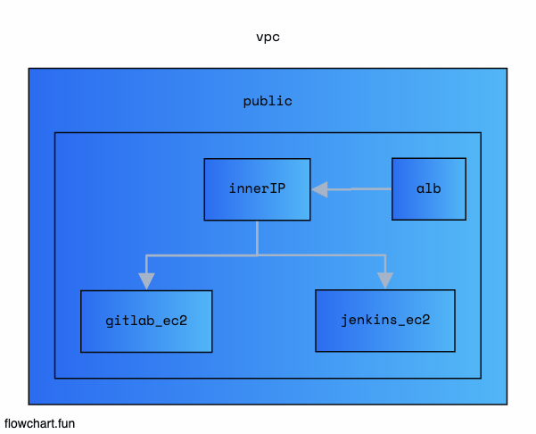
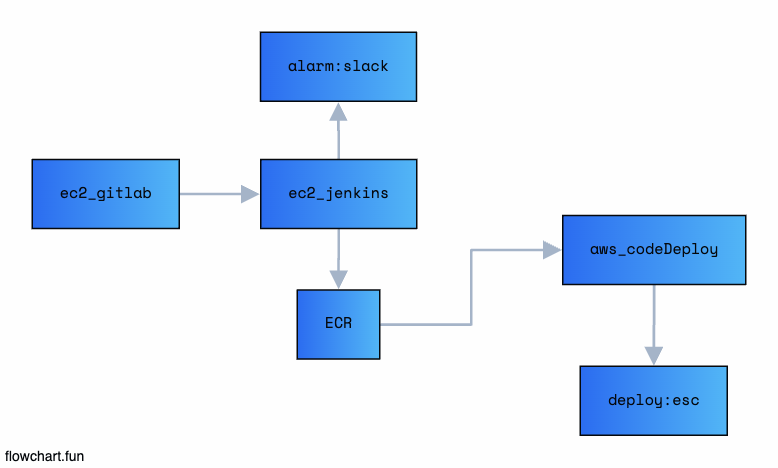

# CICD-pipeline





## Jenkins install

```
    host에 Docker에 접근하는 방식 (DooD)을 사용하기 때문에,
    host에 user, group을 먼저 설정해줘야 함

    useradd ...
    groupadd ...
```

- install docker (util_file/docker.sh)
- build docker images (util_file/Dockerfil.jenkins)

```
    docker build -f Dockerfile.jenkins -t jenkins:1.0
```

- run jenkins container

```
    docker run -d --name jenkins_container \
    -v /var/run/docker.sock:/var/run/docker.sock \
    -v jenkins_volume:/var/jenkins_home \
    --restart=always \
    -p 8080:8080 jenkins:1.0

    chmod 777 /var/run/docker.sock
```

## Reference

- t2.micro로 하니까 Docker가 못버텨주네... -> t3.small 정도는 해야함
